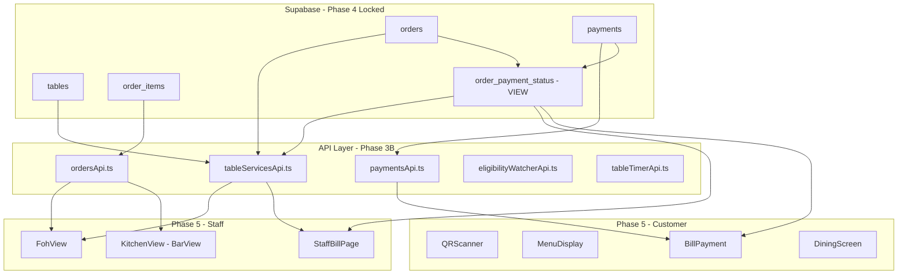

# Clean Implementation Roadmap - QR Restaurant App

**Document Version:** 1.0  
**Created:** 2026-01-09  
**Status:** DRAFT - Awaiting Approval

---

## 1. Executive Summary

This document outlines a comprehensive implementation plan for a clean, bug-free restaurant QR code application built on a canonical architecture. The system has completed database migration (Phases 1-4) and is ready for Phase 5 UI implementation with full canonical compliance.

### Current State
- ✅ **Database:** Canonical schema locked, UUID migration complete
- ✅ **Core Services:** `order_payment_status` view operational
- ✅ **Known Fixes Applied:** FOH payment stall repair completed
- ⚠️ **Remaining:** UI layer, availability model, end-to-end verification

### Target State
A production-ready restaurant QR app with:
- **End-to-end flow:** QR scan → order → pay → close
- **Zero canonical violations:** UI never decides truth
- **Reload-safe:** All state derived from database, not local storage
- **Bug-free:** All known issues from old app addressed

---

## 2. Architecture Overview

### 2.1 System Architecture Diagram



### 2.2 Data Flow: QR to Close

```mermaid
sequenceDiagram
    participant C as Customer
    participant UI as Customer UI
    participant API as Orders API
    participant DB as Database
    participant FOH as Staff UI
    participant PAY as Payment Service

    C->>UI: Scan QR Code
    UI->>DB: Fetch restaurant/menu
    DB-->>UI: Restaurant data

    C->>UI: Select table → Order items
    UI->>API: submitItemsToSupabase
    API->>DB: INSERT orders + order_items
    DB-->>FOH: Real-time order notification

    C->>UI: Request bill
    UI->>DB: Query order_payment_status
    DB-->>UI: Payment completeness

    C->>UI: Complete payment
    UI->>PAY: Process payment
    PAY->>DB: INSERT payment
    DB-->>FOH: Payment update (subscription)

    FOH->>DB: Verify payment_complete
    DB-->>FOH: All orders paid
    FOH: Close & clean table
```

### 2.3 Canonical Truth Sources

| Concept | Authoritative Source | Type |
|---------|---------------------|------|
| Payment completeness | `order_payment_status` view | Derived |
| Eligibility to close | `canCloseTable(tableId)` | Derived |
| Availability | `getTableAvailability(tableId)` | Derived |
| Order state | `orders.status` | Stored |
| Payments | `payments` table | Append-only |

### 2.4 Forbidden Patterns (Phase 4 Locked)

- ❌ `is_paid`, `is_closed`, `table_status` columns
- ❌ UI deciding truth or availability
- ❌ Background jobs mutating availability
- ❌ RLS policies with semantic logic
- ❌ Caching derived state locally

---

## 3. Phase-by-Phase Implementation Plan

### Phase 3B: Core Services (COMPLETE)
- ✅ `tableServicesApi.ts` - `canCloseTable`, `getTablePaymentSummary`
- ✅ `paymentsApi.ts` - Payment CRUD operations
- ✅ `ordersApi.ts` - Order subscriptions and mutations

### Phase 4: Database Locked (COMPLETE)
- ✅ Canonical schema verified
- ✅ `order_payment_status` view deployed
- ⚠️ `table_availability` view NOT YET DEPLOYED
- ⚠️ Remove `available` column from `restaurant_tables`

### Phase 5: UI Feature Layer (TODO)

#### 5.1 Customer UI Components

| Component | Status | Canonical Issues |
|-----------|--------|-----------------|
| `QRScanner.tsx` | ✅ Working | None |
| `RestaurantInfo.tsx` | ✅ Working | None |
| `TableSelector.tsx` | ✅ Working | None |
| `MenuDisplay.tsx` | ✅ Working | None |
| `BillPayment.tsx` | ✅ Fixed | Was ignoring order_payment_status |
| `DiningScreen.tsx` | ✅ Working | None |
| `WaitingScreen.tsx` | ✅ Working | None |

#### 5.2 Staff UI Components

| Component | Status | Canonical Issues |
|-----------|--------|-----------------|
| `FohView.tsx` | ✅ Working | Uses orders.status |
| `StaffBillPage.tsx` | ✅ Fixed | Now queries order_payment_status |
| `KitchenView.tsx` | ✅ Working | Uses orders.status |
| `BarView.tsx` | ✅ Working | Uses orders.status |
| `ManagerGate.tsx` | ⚠️ Review | Check canonical compliance |

#### 5.3 Missing Infrastructure

| Item | Priority | Description |
|------|----------|-------------|
| Availability View | 🔴 HIGH | Deploy `table_availability` view |
| Payments Subscription | 🔴 HIGH | Add to StaffDataProvider |
| E2E Tests | 🟡 MEDIUM | Verify complete flow |
| Error Boundaries | 🟡 MEDIUM | Canonical error handling |

---

## 4. Component Structure

### 4.1 Directory Layout

```
src/
├── api/                    # Service layer (Phase 3B)
│   ├── tableServicesApi.ts # canCloseTable, getTablePaymentSummary
│   ├── paymentsApi.ts      # Payment CRUD
│   ├── ordersApi.ts        # Order subscriptions
│   ├── eligibilityWatcherApi.ts
│   └── tableTimerApi.ts
├── components/             # Customer UI (Phase 5)
│   ├── QRScanner.tsx
│   ├── RestaurantInfo.tsx
│   ├── TableSelector.tsx
│   ├── MenuDisplay.tsx
│   ├── DiningScreen.tsx
│   ├── BillPayment.tsx     # ✅ FIXED: Uses order_payment_status
│   └── ...
├── staff/                  # Staff UI (Phase 5)
│   ├── FohView.tsx
│   ├── StaffBillPage.tsx   # ✅ FIXED: Uses order_payment_status
│   ├── KitchenView.tsx
│   ├── BarView.tsx
│   ├── StaffDataProvider.tsx
│   └── ...
├── types/
│   └── index.ts            # TypeScript definitions
└── utils/
    └── translations.ts
```

### 4.2 Key Type Definitions

```typescript
// Bill type - canonical payment status
export interface Bill {
  items: OrderItem[];
  subtotal: number;
  tax: number;
  tip: number;
  total: number;
  payments: Payment[];
  // CANONICAL: Payment completeness from order_payment_status view
  orderPaymentStatus?: {
    orderId: string;
    totalDue: number;
    totalPaid: number;
    isPaymentComplete: boolean;
    remainingDue: number;
  }[];
}

// Table type - availability derived, not stored
export interface Table {
  id: string;
  number: number;
  seats: number;
  location: 'patio' | 'window' | 'balcony' | 'middle' | 'secondFloor';
  // REMOVED: available - now derived
  x: number;
  y: number;
}
```

---

## 5. API/Service Layer Design

### 5.1 Core Services Reference

#### `tableServicesApi.ts` - Truth-Deriving Services

```typescript
// Check if table can be closed (derived from order_payment_status)
export async function canCloseTable(tableId: string): Promise<TableCloseEligibility>

// Get payment summary (derived from order_payment_status)
export async function getTablePaymentSummary(tableId: string): Promise<TablePaymentSummary | null>

// Comp remaining balance (only allowed write)
export async function compRemainingBalance(params: {
  orderId: string;
  remainingBalance: number;
  reason?: string;
}): Promise<{ success: boolean; payment?: any; error?: string }>
```

#### `paymentsApi.ts` - Payment Operations

```typescript
// Create payment record (INSERT-only)
export async function createPaymentRecord(params: {
  orderId: string;
  amount: number;
  currency: string;
  metadata?: Record<string, any>;
}): Promise<{ id: string; ... }>

// Update payment status
export async function updatePaymentStatus(paymentId: string, status: string): Promise<void>
```

### 5.2 Data Access Patterns

**Correct Pattern:**
```typescript
// Query order_payment_status view for payment completeness
const { data: paymentStatus, error } = await supabase
  .from('order_payment_status')
  .select('order_id, total_due, total_paid, is_payment_complete')
  .in('order_id', orderIds);
```

**Forbidden Pattern:**
```typescript
// ❌ NEVER: Derive payment status from local state
const isPaid = localPaymentState.isPaid;

// ❌ NEVER: Infer from events or timers
const isPaid = paymentEventReceived;
```

---

## 6. Known Issues from Old App & Fixes

### 6.1 Issue #1: FOH Payment Stall

**Problem:** StaffBillPage hardcoded `payments: []`, ignoring actual payments.

**Root Cause:** StaffBillPage derived bill state from `order_items` only, not from `order_payment_status` view.

**Fix Applied:** 
- StaffBillPage now queries `order_payment_status` view
- Added payments table subscription for reactive updates
- Bill object now includes `orderPaymentStatus` field

**Status:** ✅ FIXED (documented in `CANONICAL-REPAIR-FOH-PAYMENT-STALL-PROOF.md`)

### 6.2 Issue #2: Missing Payment Subscription

**Problem:** Payment updates did not trigger FOH re-render.

**Root Cause:** StaffDataProvider subscribed to `orders` table but not `payments` table.

**Fix Applied:**
- Added subscription to `payments` table in StaffBillPage
- On payment INSERT, re-query `order_payment_status` view

**Status:** ✅ FIXED

### 6.3 Issue #3: Type Mismatch (bigint vs UUID)

**Problem:** Foreign key constraints failed due to type mismatch.

**Root Cause:** `orders` table used `bigint` for ID while other tables used `uuid`.

**Fix Applied:**
- Migration `sql-migrate-orders-to-uuid.sql` executed
- All orders now use UUID identifiers

**Status:** ✅ COMPLETE

### 6.4 Issue #4: Payment Completeness Display

**Problem:** BillPayment component didn't show payment status.

**Root Cause:** Bill object lacked `orderPaymentStatus` field, UI only showed local payments.

**Fix Applied:**
- BillPayment.tsx now renders `orderPaymentStatus` section
- Shows remaining balance from canonical view

**Status:** ✅ FIXED

### 6.5 Issue #5: Availability Column Still Exists

**Problem:** `restaurant_tables.available` column violates canonical principle.

**Root Cause:** Legacy column never removed.

**Fix Required:**
- Run `sql-remove-available-column.sql`
- Deploy `table_availability` view (Phase 4C)

**Status:** ⚠️ PENDING

### 6.6 Issue #6: Table Availability View Not Deployed

**Problem:** `table_availability` view defined but not deployed.

**Root Cause:** Phase 4C deferred implementation.

**Fix Required:**
- Deploy `sql/canonical/views/sql-create-table-availability.sql`
- Update UI to use derived availability

**Status:** ⚠️ PENDING

---

## 7. Testing Strategy

### 7.1 Test Pyramid

```
        ┌─────────────┐
        │   E2E Tests │     5%  - Critical user flows
        └─────────────┘
      ┌───────────────────┐
      │  Integration Tests │   25% - API/service layer
      └───────────────────┘
    ┌─────────────────────────┐
    │     Unit Tests          │   70% - Components, utilities
    └─────────────────────────┘
```

### 7.2 Critical Test Scenarios

#### E2E: Complete Payment Flow
```typescript
test('Customer can complete payment and staff can close table', async () => {
  // 1. Create order
  const order = await createOrderWithItems([...]);
  
  // 2. Verify order_payment_status shows unpaid
  const status = await getOrderPaymentStatus(order.id);
  expect(status.is_payment_complete).toBe(false);
  
  // 3. Insert payment
  await createPaymentRecord({ orderId: order.id, amount: 50 });
  
  // 4. Verify view updated
  const updatedStatus = await getOrderPaymentStatus(order.id);
  expect(updatedStatus.is_payment_complete).toBe(true);
  
  // 5. Verify canCloseTable returns eligible
  const eligibility = await canCloseTable(order.table_id);
  expect(eligibility.eligible).toBe(true);
  
  // 6. Verify UI updates reactively
  // (Payment subscription triggers re-render)
});
```

#### E2E: Reload-Safe State
```typescript
test('State persists after page reload', async () => {
  // 1. Complete payment
  await createPaymentRecord({ orderId: order.id, amount: 50 });
  
  // 2. Reload page (simulate browser refresh)
  await reloadApp();
  
  // 3. Verify order_payment_status still shows paid
  const status = await getOrderPaymentStatus(order.id);
  expect(status.is_payment_complete).toBe(true);
});
```

### 7.3 Canonical Compliance Tests

```typescript
test('No decision point uses local state for truth', () => {
  // Audit all decision points in codebase
  const decisionPoints = findAllDecisionPoints();
  
  for (const dp of decisionPoints) {
    if (dp.usesLocalState) {
      throw new Error(`Decision point ${dp.file}:${dp.line} uses local state for truth`);
    }
  }
});

test('All payment completeness queries use order_payment_status view', () => {
  const queries = findAllSupabaseQueries('payments');
  
  for (const query of queries) {
    if (query.table === 'payments') {
      // Must be counting or summing, not determining completeness
      expect(query.aggregates).toBeDefined();
    }
  }
});
```

### 7.4 Test Coverage Targets

| Category | Target | Priority |
|----------|--------|----------|
| Payment completeness | 100% | 🔴 Critical |
| Table closure eligibility | 100% | 🔴 Critical |
| Reload safety | 100% | 🔴 Critical |
| Component rendering | 80% | 🟡 High |
| Error handling | 90% | 🟡 High |

---

## 8. Migration Path for Existing Data

### 8.1 Data Already Migrated

| Migration | Status | Date |
|-----------|--------|------|
| UUID for orders | ✅ Complete | 2026-01-08 |
| Remove available column | ⚠️ Pending | - |
| Deploy availability view | ⚠️ Pending | - |

### 8.2 Pending Migrations

#### Migration 8.2.1: Remove Available Column

```sql
-- File: sql/migrations/sql-remove-available-column.sql
ALTER TABLE restaurant_tables DROP COLUMN IF EXISTS available;
```

**Impact:** Removes non-canonical availability flag.  
**Rollback:** Add column back (data lost).

#### Migration 8.2.2: Deploy Availability View

```sql
-- File: sql/canonical/views/sql-create-table-availability.sql
CREATE VIEW table_availability AS
SELECT 
  t.id AS table_id,
  t.restaurant_id,
  COUNT(DISTINCT o.id) FILTER (WHERE o.status NOT IN ('DELIVERED', 'CANCELLED')) > 0 
    AS has_active_orders,
  COUNT(DISTINCT o.id) FILTER (
    WHERE o.status NOT IN ('DELIVERED', 'CANCELLED')
    AND NOT COALESCE(ps.is_payment_complete, false)
  ) > 0 AS has_unpaid_orders,
  NOT (
    COUNT(DISTINCT o.id) FILTER (WHERE o.status NOT IN ('DELIVERED', 'CANCELLED')) > 0 
    AND COUNT(DISTINCT o.id) FILTER (
      WHERE o.status NOT IN ('DELIVERED', 'CANCELLED')
      AND NOT COALESCE(ps.is_payment_complete, false)
    ) > 0
  ) AS is_available
FROM restaurant_tables t
LEFT JOIN orders o ON o.table_id = t.id AND o.status NOT IN ('DELIVERED', 'CANCELLED')
LEFT JOIN LATERAL (
  SELECT SUM(amount) >= COALESCE((
    SELECT SUM(oi.quantity * mi.price)
    FROM order_items oi
    JOIN restaurant_menu_items mi ON oi.menu_item_id = mi.id
    WHERE oi.order_id = o.id
  ), 0) AS is_payment_complete
  FROM payments
  WHERE order_id = o.id
) ps ON true
GROUP BY t.id, t.restaurant_id;
```

**Impact:** Enables derived availability queries.  
**Rollback:** Drop view.

### 8.3 Data Verification Checklist

- [ ] All orders have UUID identifiers
- [ ] No orphaned order_items records
- [ ] No orphaned payments records
- [ ] `available` column removed
- [ ] `table_availability` view returns correct results
- [ ] `order_payment_status` view returns correct results

---

## 9. Implementation Tasks

### 9.1 High Priority (P0)

| ID | Task | Owner | Dependencies |
|----|------|-------|--------------|
| P0-1 | Remove `available` column from `restaurant_tables` | TBD | None |
| P0-2 | Deploy `table_availability` view | TBD | P0-1 |
| P0-3 | Add payments subscription to StaffDataProvider | TBD | None |
| P0-4 | Verify complete payment flow E2E | TBD | P0-1, P0-3 |
| P0-5 | Add error boundaries to all pages | TBD | None |

### 9.2 Medium Priority (P1)

| ID | Task | Owner | Dependencies |
|----|------|-------|--------------|
| P1-1 | Create unit test suite for tableServicesApi | TBD | None |
| P1-2 | Create unit test suite for paymentsApi | TBD | None |
| P1-3 | Add canonical compliance test script | TBD | None |
| P1-4 | Verify auto-close timer integration | TBD | P0-4 |
| P1-5 | Document all decision points | TBD | None |

### 9.3 Low Priority (P2)

| ID | Task | Owner | Dependencies |
|----|------|-------|--------------|
| P2-1 | Add TypeScript strict mode | TBD | None |
| P2-2 | Add ESLint canonical rules | TBD | None |
| P2-3 | Create demo restaurant seed data | TBD | None |
| P2-4 | Add performance benchmarks | TBD | P0-4 |

---

## 10. Success Criteria

### 10.1 Functional Criteria

| Criterion | Target | Verification |
|-----------|--------|--------------|
| QR scan → order flow | 100% working | Manual testing |
| Order → payment flow | 100% working | Manual testing |
| Payment → close flow | 100% working | Manual testing |
| Reload preserves state | 100% working | E2E tests |
| Reactive updates (no refresh) | < 2 seconds | Load testing |

### 10.2 Quality Criteria

| Criterion | Target | Verification |
|-----------|--------|--------------|
| Canonical violations | 0 | Automated audit |
| TypeScript errors | 0 | Build process |
| ESLint violations | 0 | CI/CD |
| Test coverage | > 80% | Coverage report |
| Bug recurrence | 0 | Regression tests |

### 10.3 Performance Criteria

| Criterion | Target | Verification |
|-----------|--------|--------------|
| Page load time | < 2s | Lighthouse |
| API response time | < 500ms | API profiling |
| Real-time updates | < 1s | Subscription latency |

---

## 11. Risks and Mitigations

| Risk | Impact | Probability | Mitigation |
|------|--------|-------------|------------|
| Availability view returns incorrect results | High | Medium | Comprehensive testing before deploy |
| Payment subscription race conditions | Medium | Low | Optimistic UI with canonical re-query |
| Legacy code paths still exist | High | Medium | Automated canonical compliance tests |
| RLS policies blocking valid queries | Medium | Low | Test with service_role bypass |

---

## 12. Approval Checklist

- [ ] Executive summary reviewed
- [ ] Architecture diagram approved
- [ ] Phase 5 UI design approved
- [ ] Known issues list complete
- [ ] Migration path reviewed
- [ ] Test strategy approved
- [ ] Success criteria accepted
- [ ] Implementation tasks assigned

---

**Next Steps:**

1. **Review this document** and provide feedback
2. **Approve the plan** to proceed with implementation
3. **Switch to Code mode** to begin implementation

---

**Document Status:** 📝 DRAFT  
**Reviewers Needed:** Product Owner, Lead Developer  
**Approval Threshold:** Majority approval required
