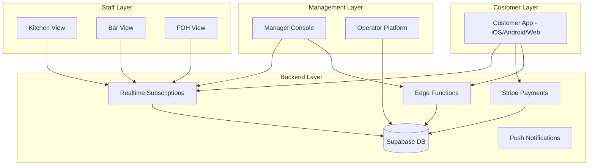
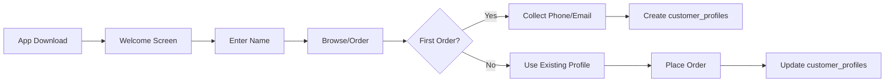
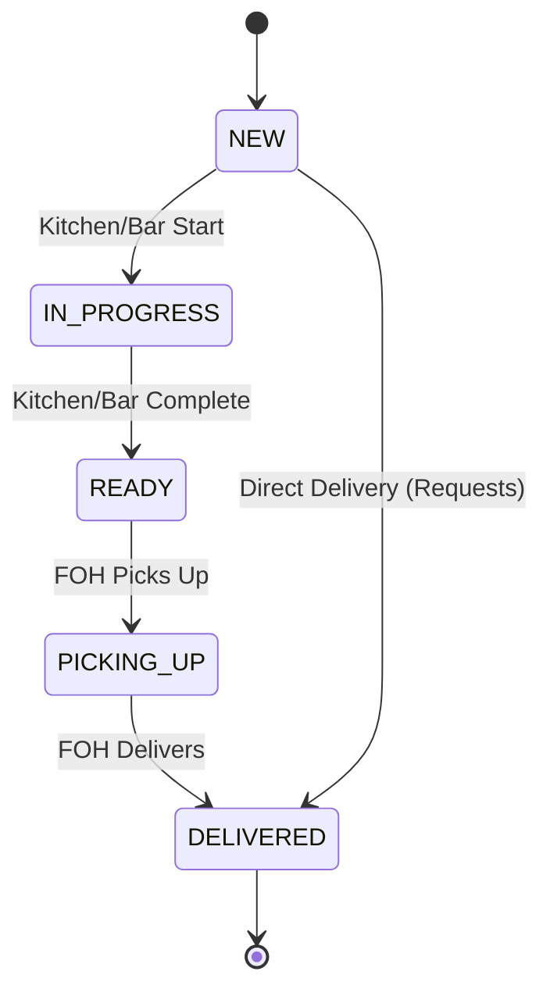
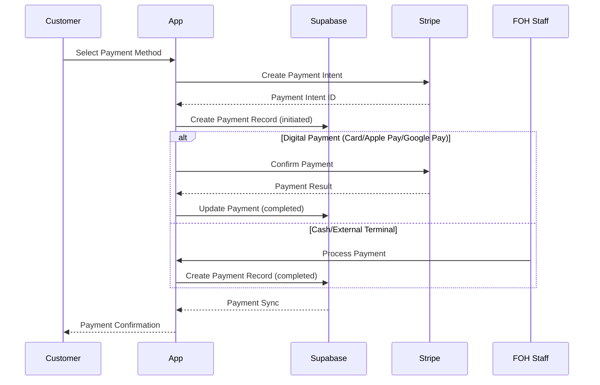
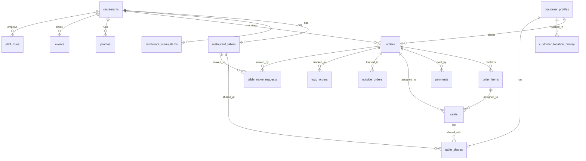

# QR Restaurant App - Complete System Specification

**Document Version**: 1.0  
**Generated**: 2026-01-09  
**Status**: Ready for Implementation  
**Database**: Supabase (PostgreSQL)

---

## 📋 Table of Contents

1. [Executive Summary](#executive-summary)
2. [System Architecture](#system-architecture)
3. [Database Schema](#database-schema)
4. [Customer App Specification](#customer-app-specification)
5. [Staff App Specification](#staff-app-specification)
6. [Manager App Specification](#manager-app-specification)
7. [Operator Platform Specification](#operator-platform-specification)
8. [API & Data Contracts](#api--data-contracts)
9. [Real-time Systems](#real-time-systems)
10. [Payment Processing](#payment-processing)
11. [Location Tracking](#location-tracking)
12. [Multi-language Support](#multi-language-support)
13. [Security & RLS](#security--rls)
14. [Deployment Guide](#deployment-guide)

---

## Executive Summary

### App Overview
A multi-tenant restaurant QR code ordering platform supporting:
- **30-50 restaurants** in a single downloadable app
- **Unique QR codes** per restaurant for direct access
- **Multi-language support** (7 languages: en, es, fr, de, ja, ar, zh)
- **Multi-device table sharing** (up to 4+ devices per table)
- **Outside ordering** with location-based auto-charge
- **Real-time synchronization** across all interfaces

### User Roles
| Role | Interface | Description |
|------|-----------|-------------|
| Customer | Mobile App | Browse, order, pay |
| Kitchen Staff | Web/Tablet | Food preparation tickets |
| Bar Staff | Web/Tablet | Drink preparation tickets |
| FOH Staff | Web/Tablet | Floor plan, delivery, service |
| Manager | Web/Tablet | Analytics, floor plan editor, promos/events |
| Operator | Web | Platform-wide analytics, billing |

### Tech Stack
- **Frontend**: React + TypeScript + Vite
- **Backend**: Supabase (PostgreSQL + Realtime + Edge Functions)
- **Styling**: Tailwind CSS
- **Payments**: Stripe
- **Localization**: JSONB-based multi-language

---

## System Architecture

### High-Level Diagram



### Component Structure

```
src/
├── api/                    # API clients for Supabase
│   ├── restaurantsApi.ts
│   ├── ordersApi.ts
│   ├── paymentsApi.ts
│   ├── restaurantMenuApi.ts
│   ├── restaurantFloorPlanApi.ts
│   ├── promosEventsApi.ts
│   ├── tableServicesApi.ts
│   ├── tableTimerApi.ts
│   ├── adminApi.ts
│   └── initializeEligibilityWatchers.ts
├── components/             # Shared UI components
│   ├── FloorPlanCanvasView.tsx
│   ├── MenuDisplay.tsx
│   ├── BillPayment.tsx
│   ├── RequestModal.tsx
│   └── ...
├── staff/                  # Staff interface components
│   ├── KitchenView.tsx
│   ├── BarView.tsx
│   ├── FohView.tsx
│   ├── ManagerEditConsole.tsx
│   └── OwnerView.tsx
├── types/                  # TypeScript definitions
│   └── index.ts
└── utils/                  # Utilities
    ├── translations.ts
    └── statusVisual.ts
```

---

## Database Schema

### Core Tables (Existing - DO NOT MODIFY)

```sql
-- restaurants: Basic restaurant info
CREATE TABLE restaurants (
  id UUID PRIMARY KEY,
  name JSONB NOT NULL,           -- Multi-language names
  address TEXT,
  hours JSONB,                   -- {"open": "9:00 AM", "close": "10:00 PM"}
  wait_time INTEGER,
  distance INTEGER,
  slug TEXT UNIQUE,              -- URL-friendly identifier
  created_at TIMESTAMPTZ,
  updated_at TIMESTAMPTZ
);

-- orders: Order headers
CREATE TABLE orders (
  id UUID PRIMARY KEY,
  restaurant_id UUID REFERENCES restaurants(id),
  order_type TEXT,               -- 'dine_in', 'to_go', 'request'
  table_id UUID,
  table_label TEXT,
  customer_name TEXT,
  customer_id UUID,
  status TEXT,                   -- 'NEW', 'IN_PROGRESS', 'READY', 'PICKING_UP', 'DELIVERED'
  kitchen_status TEXT,           -- 'NEW', 'IN_PROGRESS', 'READY'
  bar_status TEXT,               -- 'NEW', 'IN_PROGRESS', 'READY'
  foh_request_status TEXT,       -- 'NEW', 'IN_PROGRESS', 'READY'
  note TEXT,
  created_at TIMESTAMPTZ
);

-- order_items: Line items
CREATE TABLE order_items (
  id UUID PRIMARY KEY,
  order_id UUID REFERENCES orders(id),
  menu_item_id UUID,
  name TEXT NOT NULL,
  quantity INTEGER,
  price DECIMAL(10,2),
  kind TEXT,                     -- 'food', 'drink', 'request'
  note TEXT,
  seat_id UUID                   -- Links to seats table
);

-- payments: Payment records
CREATE TABLE payments (
  id UUID PRIMARY KEY,
  order_id UUID REFERENCES orders(id),
  payer_customer_id UUID,
  amount DECIMAL(10,2) NOT NULL,
  method TEXT NOT NULL,          -- 'cash', 'card', 'digital', 'auto_charge', 'external_terminal'
  status TEXT NOT NULL,          -- 'initiated', 'completed', 'failed'
  metadata JSONB,
  created_at TIMESTAMPTZ
);

-- seats: Seat attribution
CREATE TABLE seats (
  id UUID PRIMARY KEY,
  order_id UUID REFERENCES orders(id),
  seat_name TEXT NOT NULL,
  seat_position INTEGER,
  customer_id UUID,
  is_primary_seat BOOLEAN,
  created_at TIMESTAMPTZ
);

-- restaurant_tables: Table definitions
CREATE TABLE restaurant_tables (
  id UUID PRIMARY KEY,
  restaurant_id UUID REFERENCES restaurants(id),
  display_name TEXT,
  table_number INTEGER,
  seats INTEGER,
  location TEXT,                 -- 'patio', 'window', 'balcony', 'middle', 'secondFloor'
  section TEXT,
  visible_to_customers BOOLEAN,
  x INTEGER,                     -- Floor plan position
  y INTEGER,
  shape TEXT,                    -- 'round', 'square', 'rectangle', 'booth'
  rotation INTEGER,
  is_interactive BOOLEAN,
  created_at TIMESTAMPTZ,
  updated_at TIMESTAMPTZ
);

-- restaurant_menu_items: Menu items
CREATE TABLE restaurant_menu_items (
  id UUID PRIMARY KEY,
  restaurant_id UUID REFERENCES restaurants(id),
  kind TEXT,                     -- 'food', 'drink'
  category TEXT,
  station TEXT NOT NULL,         -- 'kitchen', 'bar', 'foh'
  name JSONB NOT NULL,           -- Multi-language
  description JSONB,
  price DECIMAL(10,2),
  image_url TEXT,
  is_active BOOLEAN,
  sort_order INTEGER
);

-- promos: Promotional offers
CREATE TABLE promos (
  id UUID PRIMARY KEY,
  restaurant_id UUID REFERENCES restaurants(id),
  title JSONB,
  description JSONB,
  discount_percent DECIMAL(5,2),
  discount_amount DECIMAL(10,2),
  image_url TEXT,
  menu_item_id UUID,
  menu_category TEXT,            -- 'food', 'drinks', 'all'
  layout_type TEXT,              -- 'full_width', 'two_column', 'three_column'
  is_active BOOLEAN,
  start_date TIMESTAMPTZ,
  end_date TIMESTAMPTZ
);

-- events: Special events
CREATE TABLE events (
  id UUID PRIMARY KEY,
  restaurant_id UUID REFERENCES restaurants(id),
  title JSONB,
  description JSONB,
  image_url TEXT,
  event_date DATE,
  start_time TIME,
  end_time TIME,
  is_active BOOLEAN
);

-- app_fees: Platform fee structure
CREATE TABLE app_fees (
  id UUID PRIMARY KEY,
  fee_type TEXT,                 -- 'percentage', 'fixed', 'recurring'
  amount DECIMAL(10,2),
  description TEXT
);

-- restaurant_fees: Per-restaurant fees
CREATE TABLE restaurant_fees (
  id UUID PRIMARY KEY,
  restaurant_id UUID REFERENCES restaurants(id),
  fee_type TEXT,
  amount DECIMAL(10,2),
  is_active BOOLEAN
);

-- restaurant_analytics: Timestamped events
CREATE TABLE restaurant_analytics (
  id UUID PRIMARY KEY,
  restaurant_id UUID REFERENCES restaurants(id),
  event_type TEXT,
  timestamp TIMESTAMPTZ,
  duration_ms INTEGER,
  stage TEXT,
  metadata JSONB
);

-- admin_communications: Messages to restaurants
CREATE TABLE admin_communications (
  id UUID PRIMARY KEY,
  restaurant_id UUID REFERENCES restaurants(id),
  message TEXT,
  priority TEXT,                 -- 'low', 'normal', 'high', 'urgent'
  created_at TIMESTAMPTZ,
  read_at TIMESTAMPTZ,
  expires_at TIMESTAMPTZ
);

-- system_events: Advisory event log
CREATE TABLE system_events (
  event_type TEXT,
  table_id TEXT,
  order_id BIGINT,
  payload JSONB,
  created_at TIMESTAMPTZ
);
```

### New Tables Required

```sql
-- customer_profiles: Customer account management
CREATE TABLE customer_profiles (
  id UUID PRIMARY KEY REFERENCES auth.users(id) ON DELETE CASCADE,
  phone TEXT,
  email TEXT,
  preferred_language TEXT DEFAULT 'en',
  device_token TEXT,
  default_payment_method TEXT,
  created_at TIMESTAMPTZ DEFAULT NOW(),
  updated_at TIMESTAMPTZ DEFAULT NOW()
);

-- customer_location_history: Location tracking
CREATE TABLE customer_location_history (
  id UUID PRIMARY KEY DEFAULT gen_random_uuid(),
  customer_id UUID NOT NULL REFERENCES customer_profiles(id) ON DELETE CASCADE,
  restaurant_id UUID REFERENCES restaurants(id) ON DELETE CASCADE,
  latitude DECIMAL(10, 8) NOT NULL,
  longitude DECIMAL(11, 8) NOT NULL,
  accuracy DECIMAL(10, 2),
  distance_to_restaurant DECIMAL(10, 2),
  recorded_at TIMESTAMPTZ DEFAULT NOW(),
  event_type TEXT DEFAULT 'background_update'
);

-- outside_orders: Tracking orders placed outside restaurant
CREATE TABLE outside_orders (
  id UUID PRIMARY KEY DEFAULT gen_random_uuid(),
  order_id UUID NOT NULL REFERENCES orders(id) ON DELETE CASCADE,
  customer_id UUID REFERENCES customer_profiles(id) ON DELETE SET NULL,
  distance_at_order DECIMAL(10, 2),
  distance_threshold_meters DECIMAL(10, 2) DEFAULT 100,
  auto_charge_enabled BOOLEAN DEFAULT true,
  charged_at TIMESTAMPTZ,
  status TEXT DEFAULT 'pending',
  created_at TIMESTAMPTZ DEFAULT NOW(),
  updated_at TIMESTAMPTZ DEFAULT NOW()
);

-- table_shares: Multi-device table sharing
CREATE TABLE table_shares (
  id UUID PRIMARY KEY DEFAULT gen_random_uuid(),
  table_id UUID NOT NULL REFERENCES restaurant_tables(id) ON DELETE CASCADE,
  customer_id UUID NOT NULL REFERENCES customer_profiles(id) ON DELETE CASCADE,
  seat_id UUID REFERENCES seats(id) ON DELETE SET NULL,
  device_id TEXT NOT NULL,
  is_primary_device BOOLEAN DEFAULT false,
  joined_at TIMESTAMPTZ DEFAULT NOW(),
  left_at TIMESTAMPTZ,
  status TEXT DEFAULT 'active'
);

-- togo_orders: To-go order tracking
CREATE TABLE togo_orders (
  id UUID PRIMARY KEY DEFAULT gen_random_uuid(),
  order_id UUID NOT NULL REFERENCES orders(id) ON DELETE CASCADE,
  customer_id UUID REFERENCES customer_profiles(id) ON DELETE SET NULL,
  customer_name TEXT,
  pickup_confirmed BOOLEAN DEFAULT false,
  pickup_confirmed_at TIMESTAMPTZ,
  qr_code_data TEXT UNIQUE,
  estimated_pickup_time TIMESTAMPTZ,
  actual_pickup_time TIMESTAMPTZ,
  status TEXT DEFAULT 'pending',
  created_at TIMESTAMPTZ DEFAULT NOW(),
  updated_at TIMESTAMPTZ DEFAULT NOW()
);

-- staff_roles: Staff authentication and roles
CREATE TABLE staff_roles (
  id UUID PRIMARY KEY DEFAULT gen_random_uuid(),
  restaurant_id UUID NOT NULL REFERENCES restaurants(id) ON DELETE CASCADE,
  user_id UUID REFERENCES auth.users(id) ON DELETE CASCADE,
  role TEXT NOT NULL,            -- 'owner', 'manager', 'kitchen', 'bar', 'foh', 'host'
  station_assignment TEXT,       -- 'kitchen', 'bar', 'foh', 'host', 'mixed', 'none'
  permissions JSONB DEFAULT '{}',
  is_active BOOLEAN DEFAULT true,
  created_at TIMESTAMPTZ DEFAULT NOW(),
  updated_at TIMESTAMPTZ DEFAULT NOW(),
  UNIQUE(restaurant_id, user_id, role)
);

-- table_move_requests: Table transfer requests
CREATE TABLE table_move_requests (
  id UUID PRIMARY KEY DEFAULT gen_random_uuid(),
  order_id UUID NOT NULL REFERENCES orders(id) ON DELETE CASCADE,
  customer_id UUID REFERENCES customer_profiles(id) ON DELETE SET NULL,
  from_table_id UUID REFERENCES restaurant_tables(id) ON DELETE SET NULL,
  to_table_id UUID REFERENCES restaurant_tables(id) ON DELETE SET NULL,
  status TEXT DEFAULT 'pending',
  requested_at TIMESTAMPTZ DEFAULT NOW(),
  approved_by UUID REFERENCES auth.users(id),
  approved_at TIMESTAMPTZ,
  completed_at TIMESTAMPTZ
);

-- order_sync_groups: Coordinating multi-device orders
CREATE TABLE order_sync_groups (
  id UUID PRIMARY KEY DEFAULT gen_random_uuid(),
  table_id UUID NOT NULL REFERENCES restaurant_tables(id) ON DELETE CASCADE,
  order_id UUID NOT NULL REFERENCES orders(id) ON DELETE CASCADE,
  sync_token TEXT UNIQUE,
  status TEXT DEFAULT 'open',
  created_at TIMESTAMPTZ DEFAULT NOW(),
  submitted_at TIMESTAMPTZ
);

CREATE TABLE order_sync_participants (
  id UUID PRIMARY KEY DEFAULT gen_random_uuid(),
  sync_group_id UUID NOT NULL REFERENCES order_sync_groups(id) ON DELETE CASCADE,
  customer_id UUID REFERENCES customer_profiles(id) ON DELETE SET NULL,
  device_id TEXT NOT NULL,
  is_ready BOOLEAN DEFAULT false,
  ready_at TIMESTAMPTZ,
  joined_at TIMESTAMPTZ DEFAULT NOW()
);
```

### Views

```sql
-- order_payment_status: Derives payment completeness
CREATE OR REPLACE VIEW order_payment_status AS
SELECT
  o.id AS order_id,
  o.restaurant_id,
  o.table_id,
  COALESCE(SUM(oi.price * oi.quantity), 0) AS total_due,
  COALESCE(SUM(p.amount) FILTER (WHERE p.status = 'completed'), 0) AS total_paid,
  (
    COALESCE(SUM(p.amount) FILTER (WHERE p.status = 'completed'), 0) >=
    COALESCE(SUM(oi.price * oi.quantity), 0)
  ) AS is_payment_complete
FROM orders o
LEFT JOIN order_items oi ON oi.order_id = o.id
LEFT JOIN payments p ON p.order_id = o.id
WHERE o.status NOT IN ('CANCELLED', 'REFUNDED')
GROUP BY o.id, o.restaurant_id, o.table_id;
```

---

## Customer App Specification

### App Stages (State Machine)

```typescript
type AppStage =
  | 'qr-scan'           // Initial scan screen
  | 'restaurant-info'   // Restaurant details, promos, events
  | 'table-selection'   // Floor plan, seat selection
  | 'waiting'           // Waiting for table
  | 'table-ready'       // Table ready notification
  | 'ordering-drinks'   // Drink ordering (outside or at table)
  | 'ordering-food'     // Food ordering
  | 'dining'            // Main dining screen
  | 'order-summary'     // Review current order
  | 'order-submit'      // Confirm and submit
  | 'chef-preview'      // Kitchen view (for customers)
  | 'menu-preview'      // Menu browsing
  | 'payment';          // Bill payment
```

### Customer Flow Diagram

```mermaid
stateDiagram-v2
  [*] --> qr-scan
  qr-scan --> restaurant-info: QR Code Scanned
  restaurant-info --> table-selection: View Menu / Reserve Table
  restaurant-info --> ordering-drinks: Order Drinks (Outside)
  table-selection --> waiting: Confirm Table
  table-selection --> ordering-drinks: Skip Table, Order Drinks
  waiting --> table-ready: Table Available
  table-ready --> ordering-drinks: Proceed to Table
  ordering-drinks --> dining: Order Placed
  dining --> ordering-food: Add Food
  dining --> order-summary: View Order
  order-summary --> dining: Add More
  order-summary --> order-submit: Submit Order
  order-submit --> dining: Order Sent
  dining --> payment: Request Bill
  payment --> [*]: Payment Complete
```

### Screens & Components

#### 1. QR Scanner Screen
- **File**: `src/components/QRScanner.tsx`
- **Features**:
  - Camera access for QR code scanning
  - Manual restaurant selection fallback
  - Simulation mode for testing
- **Database**: Reads `restaurants` table via `slug`

#### 2. Restaurant Info Screen
- **File**: `src/components/RestaurantInfo.tsx`
- **Features**:
  - Restaurant name, address, hours
  - Current wait time
  - Distance (if location enabled)
  - Today's promos (carousel)
  - Upcoming events
  - "View Menu & Reserve Table" CTA
- **Database**: Reads `restaurants`, `promos`, `events`

#### 3. Table Selection Screen
- **File**: `src/components/FloorPlanCanvasView.tsx`
- **Features**:
  - Interactive floor plan with drag/zoom
  - Table status: available, occupied, reserved
  - Table details: seats, location, wait time
  - Filter by location (patio, window, balcony, middle, secondFloor)
  - "Next Available Table" option
- **Database**: Reads `restaurant_tables`, derives availability from orders

#### 4. Seat Assignment Screen
- **File**: `src/components/SeatAssignmentScreen.tsx`
- **Features**:
  - Visual seat layout at selected table
  - Assign name to seat or save for later
  - Mark "This is me" for primary seat
  - Support for multiple guests
- **Database**: Writes to `seats` table

#### 5. Menu Display Screen
- **File**: `src/components/MenuDisplay.tsx`
- **Features**:
  - Category filtering (food/drinks)
  - Featured items carousel
  - Item details with images
  - Add to order with quantity/notes
  - Station assignment visible (kitchen/bar)
- **Database**: Reads `restaurant_menu_items`

#### 6. Order Summary Screen
- **File**: `src/components/OrderSummaryScreen.tsx`
- **Features**:
  - Items grouped by seat
  - Seat attribution for multi-device
  - Itemized bill preview
  - Remove items
  - Add notes
- **Database**: Reads `order_items`, `seats`

#### 7. Bill Payment Screen
- **File**: `src/components/BillPayment.tsx`
- **Features**:
  - Split bill options: even, by items, full
  - Tip allocation (service/kitchen)
  - Payment methods: card, Apple Pay, Google Pay, cash, terminal
  - Real-time payment status
  - Payment completion confirmation
- **Database**: Reads `order_items`, `payments`, writes to `payments`

#### 8. Post-Order Screen
- **File**: `src/components/PostOrderOptionsScreen.tsx`
- **Features**:
  - Continue ordering
  - Request bill
  - Call staff (request)
- **Database**: Creates `request` type orders

### Customer Data Collection Flow



### Outside Ordering Logic

```typescript
interface OutsideOrderRules {
  // Location tracking starts after first order
  trackingEnabledAfterFirstOrder: boolean;
  
  // Geofence radius (meters)
  geofenceRadius: number;
  
  // Auto-charge behavior
  autoChargeOnExit: boolean;
  
  // Notification thresholds
  warningDistance: number;  // meters
  chargeDistance: number;   // meters
  
  // Payment hold duration (seconds)
  paymentHoldDuration: number;
}
```

---

## Staff App Specification

### Staff Views

#### 1. Kitchen View
- **File**: `src/staff/KitchenView.tsx`
- **Language**: Spanish only (es)
- **Features**:
  - Rail display of food orders
  - Order cards with items, notes, table
  - Status buttons: NEW → IN_PROGRESS → READY
  - Priority: requests > food > drinks
  - Timestamps on all actions
- **Database Tables**: `orders`, `order_items`

#### 2. Bar View
- **File**: `src/staff/BarView.tsx`
- **Language**: Spanish only (es)
- **Features**:
  - Rail display of drink orders
  - Same flow as Kitchen View
  - Station: bar
- **Database Tables**: `orders`, `order_items`

#### 3. FOH View
- **File**: `src/staff/FohView.tsx`
- **Language**: Spanish only (es)
- **Features**:
  - Interactive floor plan
  - Real-time table status
  - Order signals: NEW, IN_PROGRESS, READY, PICKING_UP
  - Priority badges for requests
  - Auto-focus on urgent tables
  - Single-operator mode for small restaurants
- **Database Tables**: `restaurant_tables`, `orders`, `table_move_requests`

#### 4. Staff Bill Page
- **File**: `src/components/StaffBillPage.tsx`
- **Features**:
  - Itemized bill display
  - Mark items as paid (split bill)
  - External terminal payment flow
  - Cash payment with change calculation
- **Database Tables**: `order_items`, `payments`, `seats`

### Staff Workflow States



### FOH Priority System

| Priority | Signal | Color | Action |
|----------|--------|-------|--------|
| 1 | Request | Red | Immediate attention |
| 2 | Ready (Food) | Orange | Pick up before drinks |
| 3 | Ready (Drinks) | Yellow | Pick up after food |
| 4 | Picking Up | Blue | In transit to table |
| 5 | In Progress | Green | Being prepared |
| 6 | New | Gray | Just received |

---

## Manager App Specification

### Manager Dashboard

#### 1. Live Floor Plan
- **File**: `src/staff/ManagerEditConsole.tsx`
- **Features**:
  - Same view as FOH (read-only)
  - Real-time updates
  - Message staff capability
- **Database**: All tables (read-only)

#### 2. Floor Plan Editor
- **Features**:
  - Drag-and-drop table placement
  - Grid-based positioning (x, y)
  - Table shapes: round, square, rectangle, booth
  - Section/location assignment
  - Seat placement within tables
  - Non-table items: stage, windows, doors
- **Database**: Updates `restaurant_tables`

#### 3. Menu Editor
- **Features**:
  - Add/edit/delete menu items
  - Set prices, categories, stations
  - Toggle items active/inactive
  - Sort order management
  - Multi-language name/description
- **Database**: Updates `restaurant_menu_items`

#### 4. Promos & Events Editor
- **Features**:
  - Create/manage promotions
  - Schedule by date/time
  - Link to menu items or categories
  - Layout options: full_width, two_column, three_column
  - Create/manage events
  - Image upload
- **Database**: Updates `promos`, `events`

#### 5. Analytics Dashboard
- **Features**:
  - Daily revenue
  - Order count
  - Items sold
  - Voids and comps
  - Average table time
  - Average ticket
  - Peak hours analysis
  - Staff performance
  - Table profitability
  - Customer behavior insights
- **Database**: Reads `restaurant_analytics`, `orders`, `payments`

#### 6. Day Report
- **File**: Manager view component
- **Features**:
  - Total revenue
  - Revenue by payment method
  - Order count
  - Items sold
  - Voids count and amounts
  - Comps count and amounts
  - Average table duration
  - Average ticket price
  - Peak hours heat map

#### 7. Staff Management
- **Features**:
  - Assign staff roles
  - Station assignments
  - Permissions management
  - Login tracking
- **Database**: Updates `staff_roles`

---

## Operator Platform Specification

### Operator Dashboard

#### 1. Restaurant Overview
- **Features**:
  - All restaurants status
  - Active orders count
  - Revenue comparison
  - Health scores
- **Database**: Aggregated from all `restaurants`

#### 2. Cross-Restaurant Analytics
- **Features**:
  - Total platform revenue
  - Feature usage analytics
  - Dispute tracking
  - Anomaly detection
- **Database**: Aggregated from all `restaurant_analytics`

#### 3. Commercial Management
- **Features**:
  - Set platform-wide fees
  - Per-restaurant fee configuration
  - Trial period management
  - Promotional discounts
  - Recurring fee scheduling
- **Database**: Updates `app_fees`, `restaurant_fees`

#### 4. Communication
- **Features**:
  - Send messages to restaurants
  - Priority levels (low, normal, high, urgent)
  - Message history
  - Read/unread tracking
- **Database**: Uses `admin_communications`

#### 5. Safety & Rollbacks
- **Features**:
  - Feature flags per restaurant
  - Emergency rollback capability
  - Audit logs
- **Database**: Custom table for feature flags

---

## API & Data Contracts

### Core API Functions

```typescript
// Restaurant APIs
export async function getRestaurantBySlug(slug: string): Promise<Restaurant | null>
export async function getAllRestaurants(): Promise<Restaurant[]>
export async function getRestaurantTables(restaurantId: string): Promise<Table[]>
export async function getRestaurantMenu(restaurantId: string): Promise<{ food: MenuItem[]; drinks: MenuItem[] }>
export async function getCompleteRestaurant(identifier: string): Promise<Restaurant | null>

// Order APIs
export async function fetchOpenOrders(): Promise<OrderRow[]>
export async function fetchOrderItemsForOrders(orderIds: string[]): Promise<Map<string, OrderItemRow[]>>
export async function subscribeToOrders(onChange: (payload) => void, restaurantId?: string): Unsubscribe
export async function createOrderWithItems(input: NewOrderInput): Promise<OrderRow>
export async function updateOrderStatus(orderId: string, status: OrderStatus): void
export async function updateOrderStationStatus(orderId: string, station: StationKey, status: ProductionStatus): void
export async function markStationPickedUp(orderId: string, station: Exclude<StationKey, 'server'>): void
export async function markStationDelivered(orderId: string, station: StationKey): void

// Payment APIs
export async function createPaymentRecord(params): Promise<PaymentRecord>
export async function updatePaymentStatus(paymentId: string, status: PaymentStatus): void
export async function getPaymentRecord(paymentId: string): Promise<PaymentRecord | null>
export async function listPaymentsForOrder(orderId: string): Promise<PaymentRecord[]>

// Menu APIs
export async function fetchRestaurantMenuItems(restaurantId: string): Promise<RestaurantMenuItemRow[]>
export async function upsertRestaurantMenuItems(rows: RestaurantMenuItemRow[]): void

// Floor Plan APIs
export async function fetchRestaurantFloorPlan(restaurantId: string): Promise<RestaurantFloorPlanRow | null>
export async function upsertRestaurantFloorPlan(row: RestaurantFloorPlanRow): void

// Promos & Events APIs
export async function fetchRestaurantPromos(restaurantId: string): Promise<PromoRow[]>
export async function fetchRestaurantEvents(restaurantId: string): Promise<EventRow[]>
export async function upsertRestaurantPromos(promos: PromoRow[]): void
export async function upsertRestaurantEvents(events: EventRow[]): void
```

### Type Definitions

```typescript
// Restaurant Types
interface Restaurant {
  id: string;
  slug?: string;
  name: string;
  address: string;
  hours: { open: string; close: string };
  waitTime: number;
  distance: number;
  promos?: Promo[];
  events?: Event[];
  tables?: Table[];
  menu?: { food: MenuItem[]; drinks: MenuItem[] };
  createdAt?: string;
  updatedAt?: string;
}

interface Table {
  id: string;
  number: number;
  label?: string;
  seats: number;
  location: 'patio' | 'window' | 'balcony' | 'middle' | 'secondFloor';
  x: number;
  y: number;
  shape?: string;
}

interface MenuItem {
  id: string;
  name: Record<Language, string>;
  description: Record<Language, string>;
  price: number;
  category: string;
  image: string;
  station: 'kitchen' | 'bar' | 'foh';
}

// Order Types
type OrderStatus = 'NEW' | 'IN_PROGRESS' | 'READY' | 'PICKING_UP' | 'DELIVERED';
type OrderType = 'dine_in' | 'to_go' | 'request';
type ItemKind = 'food' | 'drink' | 'request';
type ProductionStatus = 'NEW' | 'IN_PROGRESS' | 'READY';
type StationKey = 'kitchen' | 'bar' | 'server';

// Payment Types
type PaymentStatus = 'PENDING' | 'AUTHORIZED' | 'PAID' | 'FAILED' | 'CANCELED';
type PaymentMethod = 'cash' | 'card' | 'digital' | 'auto_charge' | 'external_terminal';

// Language Types
type Language = 'en' | 'es' | 'fr' | 'de' | 'ja' | 'ar' | 'zh';
```

---

## Real-time Systems

### Supabase Realtime Channels

```typescript
// Order updates
subscribeToOrders(onChange, restaurantId)

// Payment updates
subscribeToPayments(onChange, orderId)

// Location updates (customer -> staff)
subscribeToLocationUpdates(customerId, onChange)

// Table status updates
subscribeToTableUpdates(restaurantId, onChange)
```

### Realtime Event Types

| Event | Channel | Payload |
|-------|---------|---------|
| New Order | `orders-realtime-{restaurantId}` | OrderRow |
| Order Status Change | `orders-realtime-{restaurantId}` | OrderRow |
| Payment Complete | `payments-realtime-{orderId}` | PaymentRecord |
| Table Status Change | `tables-realtime-{restaurantId}` | TableInfo |
| Location Update | `location-realtime-{customerId}` | LocationData |

---

## Payment Processing

### Supported Payment Methods

| Method | Type | Processing |
|--------|------|------------|
| Card | Digital | Stripe |
| Apple Pay | Digital | Stripe |
| Google Pay | Digital | Stripe |
| Cash | Manual | Staff-assisted |
| External Terminal | Manual | Staff-assisted |
| Auto-charge | Automatic | Stripe (on geofence exit) |

### Payment Flow



### Bill Splitting

- **Split Evenly**: Divide total by number of participants
- **Split by Items**: Assign items to specific payers
- **Pay Full**: One person pays everything

---

## Location Tracking

### Geofence Logic

```typescript
interface GeofenceConfig {
  // Restaurant location
  restaurantLat: number;
  restaurantLng: number;
  
  // Radius in meters
  entryRadius: number;
  exitRadius: number;
  
  // Auto-charge threshold
  autoChargeRadius: number;
  
  // Warning threshold (for notifications)
  warningRadius: number;
}

function checkGeofence(
  customerLocation: { lat: number; lng: number },
  config: GeofenceConfig
): GeofenceStatus {
  const distance = calculateDistance(
    customerLocation.lat, customerLocation.lng,
    config.restaurantLat, config.restaurantLng
  );
  
  if (distance > config.autoChargeRadius) {
    return { status: 'exited', shouldCharge: true, distance };
  }
  
  if (distance > config.warningRadius) {
    return { status: 'warning', shouldCharge: false, distance };
  }
  
  return { status: 'inside', shouldCharge: false, distance };
}
```

### Location Recording

```typescript
// Record location update
async function recordLocationUpdate(
  customerId: string,
  restaurantId: string,
  location: { lat: number; lng: number; accuracy: number }
) {
  const distance = await calculateDistanceToRestaurant(restaurantId, location);
  
  await supabase.from('customer_location_history').insert({
    customer_id: customerId,
    restaurant_id: restaurantId,
    latitude: location.lat,
    longitude: location.lng,
    accuracy: location.accuracy,
    distance_to_restaurant: distance,
    event_type: 'background_update'
  });
}
```

---

## Multi-language Support

### Language Detection

```typescript
function detectUserLanguage(): Language {
  // Priority: URL param > Browser locale > Default (en)
  const urlLang = new URLSearchParams(window.location.search).get('lang');
  if (urlLang && isValidLanguage(urlLang)) {
    return urlLang as Language;
  }
  
  const browserLang = navigator.language.split('-')[0];
  if (isValidLanguage(browserLang)) {
    return browserLang as Language;
  }
  
  return 'en';
}
```

### Translation Usage

```typescript
// Single translation
t('scanQR', language)

// Localized text from database
localizeText(menuItem.name, language)

// Category translation
localizeCategory(category, language)
```

### Supported Translations

| Language | Code | Staff UI | Customer UI |
|----------|------|----------|-------------|
| English | en | ❌ | ✅ |
| Spanish | es | ✅ | ✅ |
| French | fr | ❌ | ✅ |
| German | de | ❌ | ✅ |
| Japanese | ja | ❌ | ✅ |
| Arabic | ar | ❌ | ✅ |
| Chinese | zh | ❌ | ✅ |

---

## Security & RLS

### RLS Policies

```sql
-- Public read access (customer-facing)
CREATE POLICY "Public read access" ON restaurants FOR SELECT USING (true);
CREATE POLICY "Public read access" ON restaurant_menu_items FOR SELECT USING (is_active = true);
CREATE POLICY "Public read access" ON restaurant_tables FOR SELECT USING (true);
CREATE POLICY "Public read access" ON promos FOR SELECT USING (is_active = true);
CREATE POLICY "Public read access" ON events FOR SELECT USING (is_active = true);

-- Authenticated users (restaurant owners/staff)
CREATE POLICY "Authenticated can manage" ON [table] FOR ALL
  USING (auth.role() = 'authenticated')
  WITH CHECK (auth.role() = 'authenticated');

-- Service role (full access)
CREATE POLICY "Service role full access" ON [table] FOR ALL
  USING (auth.role() = 'service_role');
```

### Customer Profile Access

```sql
-- Customers can read/write their own profile
CREATE POLICY "Customers can read own profile" ON customer_profiles
  FOR SELECT USING (auth.uid() = id);

CREATE POLICY "Customers can update own profile" ON customer_profiles
  FOR UPDATE USING (auth.uid() = id);

-- Staff can read customer profiles for orders
CREATE POLICY "Staff can read customer profiles" ON customer_profiles
  FOR SELECT USING (
    EXISTS (
      SELECT 1 FROM staff_roles
      WHERE staff_roles.restaurant_id IN (
        SELECT restaurant_id FROM orders WHERE customer_id = auth.uid()
      )
    )
  );
```

---

## Deployment Guide

### Database Migration Steps

1. **Run pending migrations**
   ```bash
   # Execute in order
   sql-remove-available-column.sql
   ```

2. **Create new tables**
   ```bash
   # Create all new tables from specification
   sql-create-customer-profiles.sql
   sql-create-customer-location-history.sql
   sql-create-outside-orders.sql
   sql-create-table-shares.sql
   sql-create-togo-orders.sql
   sql-create-staff-roles.sql
   sql-create-table-move-requests.sql
   sql-create-order-sync-groups.sql
   ```

3. **Add new columns**
   ```bash
   # Add columns to existing tables
   sql-add-restaurant-columns.sql
   sql-add-orders-columns.sql
   sql-add-seats-columns.sql
   sql-add-payments-columns.sql
   ```

4. **Apply RLS policies**
   ```bash
   sql-update-rls-policy.sql
   ```

5. **Verify schema**
   ```bash
   node verify-schema-sql.js
   ```

### Environment Configuration

```env
# Supabase Configuration
VITE_SUPABASE_URL=your-project-url
VITE_SUPABASE_ANON_KEY=your-anon-key

# Stripe Configuration (if using)
VITE_STRIPE_PUBLISHABLE_KEY=pk_test_xxx

# Feature Flags
VITE_ENABLE_LOCATION_TRACKING=true
VITE_ENABLE_MULTI_DEVICE=true
VITE_ENABLE_TOGO_ORDERS=true
```

### Build & Deploy

```bash
# Install dependencies
npm install

# Run development server
npm run dev

# Build for production
npm run build

# Deploy to hosting platform
npm run deploy
```

---

## Appendices

### Appendix A: Complete Translation Keys

See [`src/utils/translations.ts`](src/utils/translations.ts) for complete translation keys.

### Appendix B: Database ER Diagram



### Appendix C: Screen-to-Database Mapping

| Screen | Reads | Writes |
|--------|-------|--------|
| QR Scanner | `restaurants` | - |
| Restaurant Info | `restaurants`, `promos`, `events` | - |
| Table Selection | `restaurant_tables` | - |
| Seat Assignment | `seats` | `seats` |
| Menu Display | `restaurant_menu_items` | - |
| Order Summary | `order_items`, `seats` | - |
| Bill Payment | `order_items`, `payments` | `payments` |
| Kitchen View | `orders`, `order_items` | `orders` |
| Bar View | `orders`, `order_items` | `orders` |
| FOH View | `restaurant_tables`, `orders` | `orders` |
| Manager Dashboard | All tables | All tables |
| Floor Plan Editor | `restaurant_tables` | `restaurant_tables` |
| Menu Editor | `restaurant_menu_items` | `restaurant_menu_items` |
| Promos/Events Editor | `promos`, `events` | `promos`, `events` |
| Analytics | `restaurant_analytics`, `orders`, `payments` | - |

---

**Document End**

This specification is ready for implementation. All database tables, API endpoints, and component structures are defined to match the existing Supabase schema while extending functionality for the new features described.
